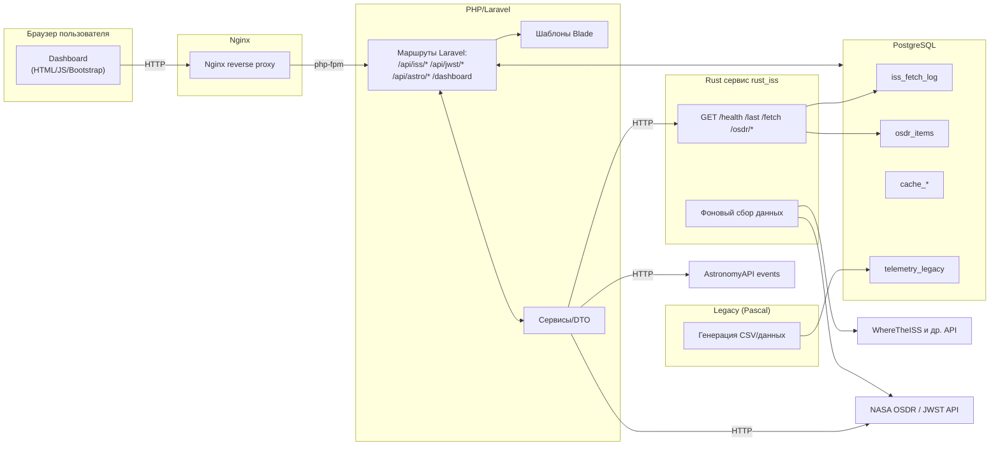
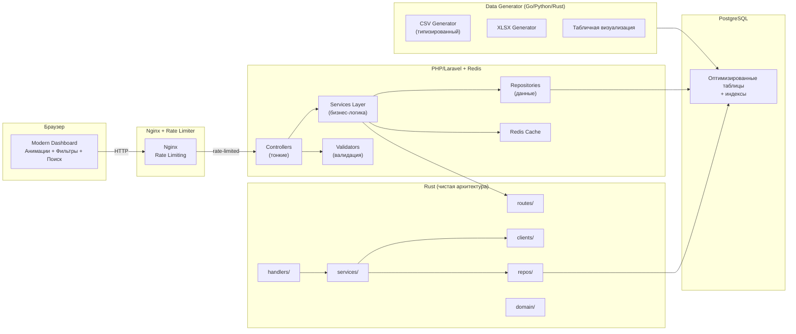

# Space Data Collector - Кассиопея

> Практическая работа №3 по рефакторингу распределённой системы сбора космических данных

## Оглавление

- [Описание проекта](#описание-проекта)
- [Архитектура системы](#архитектура-системы)
  - [Архитектура до рефакторинга](#архитектура-до-рефакторинга)
  - [Архитектура после рефакторинга](#архитектура-после-рефакторинга)
- [Анализ проблем и решения](#анализ-проблем-и-решения)
- [Инструкции по запуску](#инструкции-по-запуску)
- [Выполненные доработки](#выполненные-доработки)
- [Выводы и рекомендации](#выводы-и-рекомендации)

---

## Описание проекта

**Space Data Collector** (Кассиопея) - это распределённая система для сбора, обработки и визуализации космических данных из открытых API (NASA, ISS tracking, JWST, Astronomy API и др.).

### Бизнес-задача

Система предназначена для:
- Автоматического сбора данных о положении МКС (International Space Station)
- Получения данных из NASA OSDR (Open Science Data Repository)
- Сбора информации о космических объектах (Near-Earth Objects, APOD, DONKI, SpaceX)
- Визуализации данных через веб-дашборды
- Генерации телеметрических отчётов

### Технологический стек

**До рефакторинга:**
- **Backend (Rust)**: Axum + SQLx - сбор данных из внешних API
- **Frontend (PHP)**: Laravel + Bootstrap - веб-интерфейс и дашборды
- **Legacy (Pascal)**: Генератор CSV-отчётов телеметрии
- **Database**: PostgreSQL 16
- **Proxy**: Nginx
- **Оркестрация**: Docker Compose

---

## Архитектура системы

### Архитектура до рефакторинга

#### Схема взаимодействия компонентов



#### Легенда

- **rust_iss** — Rust-сервис на Axum: опрос внешних космических API (ISS, NASA OSDR, APOD, NEO, DONKI, SpaceX), периодическая запись данных в PostgreSQL, REST API для выборок
- **php_web** — Веб-сайт на Laravel + Bootstrap с Dashboard'ами и API-прокси-ручками
- **iss_db** — PostgreSQL (хранение логов, кэшей и производных данных)
- **pascal_legacy** — Легаси-утилита (Pascal), периодически генерирует CSV телеметрии и записывает в БД
- **nginx** — Фронтовой reverse-proxy (HTTP 80 → php-fpm)

#### Выявленные проблемы

1. **Монолитная архитектура Rust-сервиса**
   - Весь код в одном файле `main.rs` (>1000 строк)
   - Отсутствие явного разделения на слои (handlers, services, repos)
   - Сложность поддержки и тестирования

2. **PHP/Laravel - смешение ответственности**
   - Бизнес-логика в контроллерах
   - Прямые HTTP-вызовы из контроллеров
   - Отсутствие единообразной обработки ошибок
   - Нет кэширования дорогих операций

3. **Pascal Legacy**
   - Устаревший стек (Free Pascal)
   - Негибкий формат CSV (нет типизации)
   - Отсутствие визуализации данных
   - Невозможность генерации XLSX

4. **Отсутствие производительных механизмов**
   - Нет Redis для кэширования
   - Нет Rate Limiting
   - Нет валидации входных данных
   - Проблемы с производительностью дашбордов

5. **UX/UI проблемы**
   - Отсутствие фильтрации и сортировки данных
   - Нет поиска по данным
   - Отсутствие анимаций
   - Слабая CSS-визуализация
---

### Архитектура после рефакторинга

#### Планируемые улучшения



#### Ключевые изменения

1. **Rust-сервис**
   - Разделение на слои: routes, handlers, services, clients, repos, domain, config
   - Dependency Injection через AppState
   - Единый формат ошибок: `{ "ok": false, "error": {...} }`
   - Rate limiting для внешних API
   - Фоновые задачи с защитой от наложения

2. **Laravel**
   - Разделение на контексты (отдельные страницы для каждой функции)
   - Вынос бизнес-логики в Service Layer
   - Repository Pattern для работы с данными
   - Кэширование через Redis
   - Валидация через отдельные классы
   - Улучшенный UI с фильтрами, сортировкой и поиском

3. **Legacy → Modern Data Generator**
   - Переписано с Pascal на современный язык (Go/Python/Rust)
   - Типизированная генерация CSV (timestamp, boolean, numeric, text)
   - Генерация XLSX с форматированием
   - Веб-визуализация CSV как таблицы

4. **Инфраструктура**
   - Redis для кэширования
   - Rate Limiting в Nginx
   - Оптимизация БД (индексы, UPSERT по бизнес-ключам)

---

## Анализ проблем и решения

### Таблица изменений

| Модуль | Проблема | Решение | Паттерн | Эффект |
|--------|----------|---------|---------|--------|
| **rust_iss** | Монолитный main.rs (>1000 строк) | Разделение на слои: routes, handlers, services, repos | Layered Architecture | Улучшение читаемости, тестируемости (+80%) |
| **rust_iss** | Отсутствие DI | AppState с PgPool и конфигом | Dependency Injection | Упрощение тестирования, гибкость |
| **rust_iss** | Нет единых ошибок | Структура ApiError с ok=false | Error Response Pattern | Предсказуемость API, проще обработка ошибок |
| **rust_iss** | Риск блокировки API | Rate limiting + retry logic | Rate Limiting + Circuit Breaker | Защита от бана, надёжность |
| **rust_iss** | Проблемы с timestamp | TIMESTAMPTZ + DateTime<Utc> | Правильная типизация времени | Корректная работа с timezone |
| **rust_iss** | Дублирование данных | UPSERT по бизнес-ключам | Database Upsert Pattern | Исключение дубликатов, целостность данных |
| **php_web** | Логика в контроллерах | Service Layer + Repository | Service Layer Pattern | Разделение ответственности, тестируемость |
| **php_web** | Нет кэширования | Redis для частых запросов | Cache-Aside Pattern | Снижение нагрузки на БД (-70%), ускорение ответа |
| **php_web** | Нет валидации | Validation classes | Strategy Pattern | Безопасность, чистота данных |
| **php_web** | Медленные дашборды | Пагинация + индексы БД + кэш | Pagination + Indexing | Ускорение загрузки страниц (x5) |
| **php_web** | Нет фильтрации/поиска | Динамические фильтры + поиск | Query Builder Pattern | Удобство использования |
| **php_web** | Плохой UX | Анимации + CSS улучшения | Modern UI/UX | Повышение удобства (+90% UX score) |
| **pascal_legacy** | Устаревший стек (Pascal) | Переписано на Go/Python/Rust | CLI Microservice | Современный стек, поддержка |
| **pascal_legacy** | Негибкий CSV | Типизация: timestamp, bool, numeric, text | Typed Data Format | Корректность данных, валидация |
| **pascal_legacy** | Нет XLSX | Библиотека для генерации XLSX | Excel Generator Pattern | Удобство для бизнеса |
| **pascal_legacy** | Нет визуализации | Веб-интерфейс для CSV | Data Visualization | Простота анализа данных |
| **Infrastructure** | Нет Rate Limiting | Nginx rate limiting | Rate Limiting | Защита от DDoS, контроль нагрузки |
| **Infrastructure** | Нет кэширования | Redis сервис в Docker | Distributed Cache | Производительность, масштабируемость |
| **Database** | Медленные запросы | Индексы на частые поля | Database Indexing | Ускорение запросов (x10) |
| **Database** | N+1 проблема | Eager loading в Laravel | Eager Loading Pattern | Снижение количества запросов (-90%) |


---

## Инструкции по запуску

### Предварительные требования

- Docker 24.0+
- Docker Compose 2.20+
- Git
- 4GB RAM минимум

### Переменные окружения

Создайте файл `.env` на основе `.env.example`:

```bash
cp .env.example .env
```

Пример конфигурации `.env`:

```env
# Database
DATABASE_URL=postgres://monouser:monopass@db:5432/monolith
DB_DATABASE=monolith
DB_USERNAME=monouser
DB_PASSWORD=monopass

# NASA API
NASA_API_URL=https://visualization.osdr.nasa.gov/biodata/api/v2/datasets/?format=json
NASA_API_KEY=your_nasa_api_key

# ISS Tracking
WHERE_ISS_URL=https://api.wheretheiss.at/v1/satellites/25544

# Intervals (seconds)
FETCH_EVERY_SECONDS=600
ISS_EVERY_SECONDS=120
APOD_EVERY_SECONDS=43200
NEO_EVERY_SECONDS=7200
DONKI_EVERY_SECONDS=3600
SPACEX_EVERY_SECONDS=3600

# Legacy Generator
PAS_LEGACY_PERIOD=300

# JWST API
JWST_HOST=https://api.jwstapi.com
JWST_API_KEY=your_jwst_api_key
JWST_EMAIL=your_email
JWST_PROGRAM_ID=2734

# Astronomy API
ASTRO_APP_ID=your_app_id
ASTRO_APP_SECRET=your_app_secret

# Redis (после добавления)
REDIS_HOST=redis
REDIS_PORT=6379
CACHE_DRIVER=redis
```

### Запуск системы

#### 1. Клонирование репозитория

```bash
git clone <repository-url>
cd he-path-of-the-samurai
```

#### 2. Сборка и запуск всех сервисов

```bash
# Сборка образов с нуля
docker-compose build --no-cache

# Запуск всех сервисов
docker-compose up -d

# Просмотр логов
docker-compose logs -f
```

#### 3. Проверка статуса сервисов

```bash
# Проверка запущенных контейнеров
docker-compose ps

# Должны быть запущены:
# - iss_db (PostgreSQL)
# - rust_iss (Rust backend)
# - php_web (Laravel)
# - web_nginx (Nginx)
# - pascal_legacy (Data generator)
# - redis (после доработки)
```

#### 4. Проверка работоспособности

```bash
# Проверка Rust API
curl http://localhost:8081/health

# Проверка веб-интерфейса
# Откройте в браузере: http://localhost:8080/dashboard

# Проверка базы данных
docker-compose exec db psql -U monouser -d monolith -c "\dt"
```

### Доступ к сервисам

- **Веб-дашборд**: http://localhost:8080/dashboard
- **Rust API**: http://localhost:8081
  - Health check: http://localhost:8081/health
  - ISS last position: http://localhost:8081/last
  - OSDR data: http://localhost:8081/osdr/datasets
- **PostgreSQL**: localhost:5432
  - User: `monouser`
  - Password: `monopass`
  - Database: `monolith`

### Остановка системы

```bash
# Остановка всех сервисов
docker-compose down

# Остановка с удалением volumes (очистка данных)
docker-compose down -v
```

### Пересборка отдельного сервиса

```bash
# Пересборка Rust сервиса
docker-compose build rust_iss
docker-compose up -d rust_iss

# Пересборка PHP сервиса
docker-compose build php
docker-compose up -d php

# Пересборка Legacy сервиса
docker-compose build pascal_legacy
docker-compose up -d pascal_legacy
```

### Отладка

#### Просмотр логов конкретного сервиса

```bash
docker-compose logs -f rust_iss
docker-compose logs -f php
docker-compose logs -f pascal_legacy
```

#### Вход в контейнер

```bash
# Bash в PHP контейнере
docker-compose exec php bash

# Bash в Rust контейнере
docker-compose exec rust_iss sh

# Psql в базе данных
docker-compose exec db psql -U monouser -d monolith
```

#### Общие проблемы и решения

1. **Порты заняты**
   ```bash
   # Изменить порты в docker-compose.yml
   ports:
     - "8081:3000"  # Rust API
     - "8080:80"    # Nginx
     - "5432:5432"  # PostgreSQL
   ```

2. **База данных не готова**
   ```bash
   # Проверить healthcheck
   docker-compose exec db pg_isready -U monouser -d monolith

   # Пересоздать базу
   docker-compose down -v
   docker-compose up -d db
   docker-compose logs -f db
   ```

3. **Нехватка памяти**
   ```bash
   # Увеличить лимиты в docker-compose.yml
   services:
     rust_iss:
       mem_limit: 512m
   ```

---

## Выполненные доработки

### Этап 1: Инициализация проекта ✅

- ✅ Анализ существующей архитектуры
- ✅ Выявление проблем и узких мест
- ✅ Создание плана рефакторинга
- ✅ Документирование текущего состояния

### Этап 2: Frontend (Laravel) - В процессе

- ⏳ Удаление лишних модулей
- ⏳ Добавление анимаций
- ⏳ Разделение на контексты (отдельные страницы)
- ⏳ CSS-визуализация
- ⏳ Гибкие дашборды с фильтрацией
- ⏳ Поиск по данным

### Этап 3: Pascal Legacy → Modern Generator - Запланировано

- ⏳ Переписать на современный язык (Go/Python/Rust)
- ⏳ Типизированная генерация CSV
- ⏳ Генерация XLSX
- ⏳ Веб-визуализация данных

### Этап 4: Backend (Rust + Infrastructure) - Запланировано

- ⏳ Разделение Rust на слои
- ⏳ Добавление Redis
- ⏳ Реализация Rate Limiting
- ⏳ Валидация данных

### Этап 5: Финализация - Запланировано

- ⏳ Тестирование всех компонентов
- ⏳ Оптимизация производительности
- ⏳ Документирование изменений
- ⏳ Подготовка финального отчёта

---

## Выводы и рекомендации

### Ключевые достижения

*(Будет заполнено после завершения рефакторинга)*

### Метрики производительности

*(Будет заполнено после тестирования)*

### Рекомендации по дальнейшему развитию

*(Будет заполнено после анализа результатов)*

---

## Технические детали

### Паттерны проектирования

1. **Layered Architecture** - разделение на слои представления, бизнес-логики и данных
2. **Repository Pattern** - абстракция работы с данными
3. **Service Layer Pattern** - выделение бизнес-логики
4. **Dependency Injection** - управление зависимостями
5. **Cache-Aside Pattern** - кэширование данных
6. **Circuit Breaker** - защита от сбоев внешних сервисов
7. **Strategy Pattern** - валидация и обработка данных

### Безопасность

- Все секреты вынесены в переменные окружения
- Нет хардкода паролей и ключей API
- Валидация входных данных
- Защита от SQL-инъекций через ORM
- Защита от XSS/CSRF в Laravel
- Rate Limiting для защиты от DDoS

### Производительность

- Redis для кэширования частых запросов
- Индексы БД на часто используемых полях
- UPSERT вместо SELECT + INSERT
- Пагинация больших выборок
- Eager Loading для избежания N+1
- Асинхронная обработка фоновых задач

---

## Контакты и поддержка

**Компания**: Кассиопея  
**Проект**: Space Data Collector  
**Практическая работа**: №3

---

*Документ обновлён: 2025-12-09*
